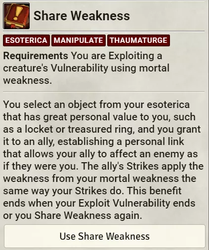

# PF2e Exploit Vulnerability

Project manifest URL: https://github.com/mysurvive/pf2e-thaum-vuln/releases/latest/download/module.json
  
Improvement for Thaumaturge Exploit Vulnerability

This project is a carryover until the pf2e system for Foundry VTT implements Thaumaturge Exploit Vulnerability

## IMPORTANT!!!

<strong>Make sure actors are assigned to players!</strong> 
<strong>IWR must be turned on in the PF2e System Automation Settings or damage will not be applied properly</strong> 
<strong>A thaumaturge's Esoteric Lore entry must be listed as Esoteric Lore, Esoteric, or Lore Esoteric or it will not work</strong>
 
Don't use an importer. It breaks stuff. 
Seriously, not just with the module, but also in the system. 
Don't use them. 

## Functionality

### Feats

<ul>
<li> Breached Defenses: Mostly works except in cases where the highest bypassable resistance is a combination of two traits (such as an adamantine golem's resistance to Vorpal Adamantine damage) or when the damage is not part of the PF2E system's known traits
<li> Esoteric Warden: Benefits granted upon a successful or critically successful Exploit Vulnerability roll. Per the rules, you cannot gain the benefit of Esoteric Warden from the same creature until you rest for the night.
<li> Sympathetic Vulnerabilities: Mortal Weakness or Personal Antithesis are automatically applied to all appropriate tokens on the scene. You can disable this by turning off the "Use Exploit Vulnerability Automation" setting in the module Settings.
<li> Share Weakness: A dialog box with buttons to choose party members to share weakness with. It grabs all allied tokens on the scene, so if the token you are looking for isn't in the dialog box check its alliance status.
<li> Cursed Effigy: After clicking the action in the actor's sheet, the "Use Cursed Effigy" button will show on the chat card. Click this to apply the effect to the target.
<li> Shared Warding: A dialog asking to apply to nearby allies when Esoteric Warden is available. If chosen yes, all allies within 30 feet will have the Esoteric Warden effect applied to them.
<li> Twin Weakness: Click the action in your actions tab on your character sheet, then click the button in the chat card. You will be prompted for the weapon you wish to attack with and your current map. On any roll but a critical failure, a damage roll will be put in the chat based on your current Exploit Vulnerability value.
<li> Ubiquitous Weakness: After choosing Mortal Weakness when exploiting vulnerability, a dialog box will appear asking if you would like to apply your Mortal Weakness Effect to all allies within 30 ft. If yes, another dialog box will appear, giving you the option to choose any allies within 30 ft. to apply the effect to.
<li> Root to Life: Target a dying creature and run the macro. You will be prompted to choose the one action or two action version of the feat. For the single action version, the dying condition will be removed and the unconscious condition will be added. For the two action version, the dying condition will be removed and the unconscious condition will be added. A recovery check will be made for all persistent damage on the creature at DC 10 rather than DC 15.
</ul>

This is a work in progress.

1. Import the Exploit Vulnerability macro from the "MySurvive's Thaumaturge Macros" compendium and give the player the proper permissions to execute the macro.
2. The player should drag the macro onto their hotbar.
3. The player must target exactly one enemy on the screen, then run the macro.
4. The macro will roll the Esoteric Lore check and compare it to the target's level DC. It will determine the degree of success and automate the effects.

Critical Success: The player will receive a dialog window that provides all weaknesses, resistances, and immunities, if there are any. They will be able to choose whether they want to exploit a personal antithesis or a mortal weakness, providing them with values at a quick glance to show which is higher. Making a choice will apply an effect to them (Exploit Mortal Weakness or Exploit Personal Antithesis) and to the enemy (Mortal Weakness Effect (SOURCE NAME) or Personal Antithesis Effect (SOURCE NAME)).

Success: The player will receive a dialog window that provides the highest weakness of the target, if there is one. Like on a critical success, it will provide values at a quick glance that will show which is higher and apply appropriate effects based on choice in the dialog.

Failure: The Personal Antithesis effects will be added to the player and the target.

Critical Failure: An off-guard effect will be applied to the player that will drop off at the beginning of their next turn.

5. In the event that the player chooses to exploit a Mortal Weakness (or the sympathetic weakness feat), there is another macro for GMs to use that will apply the Mortal Weakness effect to additional targets that fit the criteria "enemies of the exact same type." Since Paizo doesn't explicitly state what qualifies as a creature type, or "exact same type," this has been provided in a macro for GMs to use at their discretion. However, the default behavior is for the module to apply the effect to all targets of the same name in the scene. Simply target the actors that should have the effect (I recommend using shift+T to target multiple targets), select the thaumaturge that created the effect, and then run the "Force EV" macro from the "MySurvive's Thaumaturge Macros" compendium.

   

6. When the thaumaturge attacks, the value of the exploit vulnerability will only be added to their attacks, taking IWR into account.
   

 
Relevant actions have buttons on their chat cards to run their respective macros (currently only Exploit Vulnerability, Share Weakness, and Cursed Effigy). See the below example:
 

## Implement Management

There is a rudimentary implement management system built into the module. It will not apply any effects from the Thaumaturge implements, but it will help track which ones are currently assigned as your current implements.
 
In the character sheet, at the bottom of the inventory tab, there is a section called "Thaumaturge Implements" with a button called "Manage Implements" under it. Clicking this button will open a dialog that allows you to drag & drop items from your inventory into each of the boxes to assign an item to be your implement. Confirm the changes, and it will apply these items as your implements. You have a quick reference as to which items are your implements on the inventory tab of the character sheet. To change the implements, click the Manage Implements button again, and drag & drop items from your inventory as before.
 

 
Any item can be assigned to any implement, so it is up to the GM to check the player's implements and the player to stay honest.

## Settings

There are settings to turn on/off the

- Exploit Vulnerability automation: (On by default) This will stop the module from applying the effects of Personal Antithesis or Mortal Weakness to valid tokens on the scene. This setting is useful for if you want to manually set the Exploit Vulnerability targets via the forceEV macro.
- IWR Value Mystification: (Off by default) This will mystify the weakness values in the dialog box after using the Exploit Vulnerability macro.
- Esoteric Lore DC Modifier: (0 by default) This allows the GM to set a global modifier for Recall Knowledge DCs that use Esoteric Lore. For example, if the GM would like the DC for Recall Knowledge using Esoteric Lore to align with applicable lore skills, they would set the modifier to -2. This currently only works when using Exploit Vulnerability.
- Enforce Held Implement: (On by default) This setting forces the player to have an implement equipped before using the Exploit Vulnerability macro. If you don't care whether they have an implement held or not, turn this off.

## Reporting Issues

Please report any issues you find. I can't guarantee that I can get to them extremely quickly, but I will do my best.

### More Usage Clips

